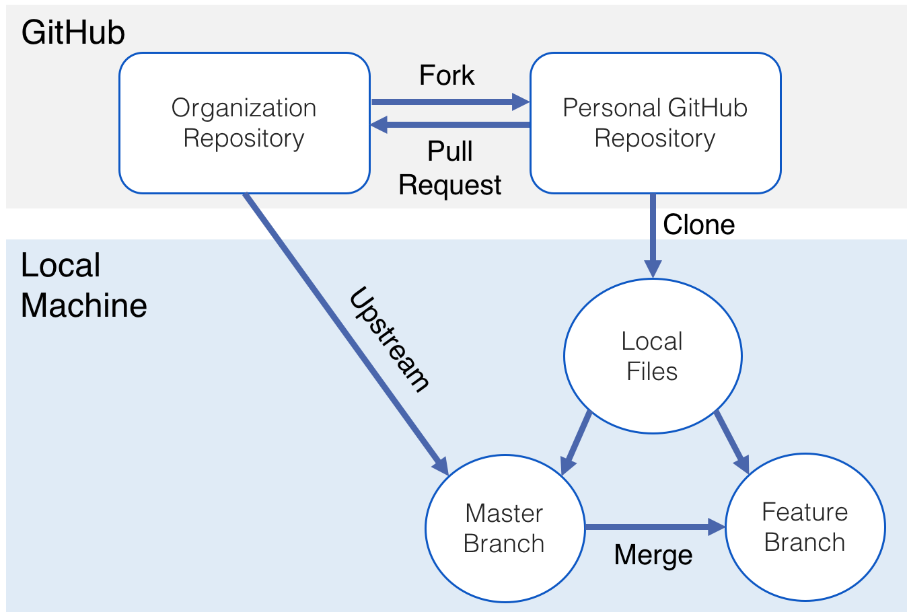

# Git & GitHub

Learning Git / GitHub workflow

# Table of Contents

- [What is Git](#what-is-git)
- [What is GitHub](#what-is-github)
- [Terminology](#terminology)
- [Installing Git](#installing-git)
    - [Initial Setup](#initial-Setup)
- [Common Git Commands](#common-git-commands)
    - [Staging Files](#staging-files)
    - [Committing Changes](#committing-changes)
    - [Pushes](#pushes)
    - [Pulls](#pulls)
    - [Branches](#branches)
    - [Moving between Branches](#moving-between-branches)
    - [Logs](#git-log)
    - [Git Man Page](#git-manual)
- [Common Workflow](#common-workflow)
- [Merge a Branch](#merge-a-branch)
- [Deleting Branches](#deleting-branches)
- [Forks and Pull Request](#fork-and-pull-request)
- [Visual Aid](#a-visual-aid)
- [Videos](#videos)
- [Other Web Resources](#web-resources)

## What is Git
Git is a version control system, its a way for us to track changes in our code locally, manage a project locally and many other things. Git and GitHub are in no way connected to one another rather they are two separate tools. Git is a way to track, save and manage changes within your code and GitHub is a place where you can safely store your code as a backup. Git is a CLI tool while GitHub is a web application / collaborative space for developers.

## What is GitHub
GitHub is a place where you are able to store, share and collaborate with others on project and code. GitHub is free to use and is 
one of many places where code can be stored online for free. We use GitHub to 
store code as a backup, over time you will have many projects and code bases that will end up taking lots of space on your machine, its also a place where you can backup your code. Should your computer hard drive or SSD ever go corrupt your code is safe in GitHub.

NOTE: Other than GitHub there are other platforms like it such as GitLab, BitBucket ect. All of them server the same purpose with slight variations in what the platform offers as extra features. Through out our journey however we will stick to using GitHub, but feel free to use whatever you want!

## Terminology

- repository → The "directory" or folder that contains the code, but is tracked by Git
- remote → A repository on GitHub (or on another machine / server)
- branch → A split from the current branch, allows for new features without altering the functioning code in a code base
- un-tracked → New file / directory that is not tracked by Git
- tracked → Changes are being tracked by Git
- staged → The file(s) is added but the changes have not been committed (saved) yet
- commit → All changes are saved and a 'snapshot' is made of the current state of the code (on your local machine)
- push → Push the changes (commits) to the origin (local repository) or remote repository
- pull → Pull changes from a remote to your local repository (will pull the changes to the matching branch; main (remote) → main (local))

## Installing Git

In order to install Git on your system either refer to the commands (\*nix based) or 
refer to the Git-SCM page and find the correct system specs.

    - Debian Based Distros (Pop_Os!/Ubuntu/LinuxMint)
    ```
    sudo apt install git
    ```

    
    - Arch Based (Arch, Manjaro, Endeavour, ArcoLinux)
    ```
    sudo pacman -S git
    ```

- Git first time setup

  [Git - First-Time Git Setup](https://git-scm.com/book/en/v2/Getting-Started-First-Time-Git-Setup)


## Initial Setup

```bash
git config --global user.name "John Doe"
git config --global user.email johndoe@example.com
```

the above commands need to be ran once in order to use git properly. Be sure to replace "John Doe" with your name and the email "johndoe@example.com" with your email

## Common Git commands

### Cloning a project 

```bash
git clone <link>
```

Clone / download a repo (project) onto your computer, in the current directory / folder you are in

EX: `git clone [https://github.com/Machine-Academy/git-workflow.git](https://github.com/Machine-Academy/git-workflow.git)`

### Staging Files

```bash
git add .
```

Add all changed files and folders, in the current folder you are in, into the `staging` area

ex: git add .

NOTE: . (dot) represents the current directory / folder that you are in.

```bash
git add fileName [file2, file3 ....]
```

Add individual file(s) to the staging area, to be committed

### Committing Changes

```bash
git commit -m "commit message"

# Optionally for Git clout
git commit -m "commit type: general message

details about the commit here"
```

- Git Commits: Semantic Commits

  [Semantic Commit Messages](https://gist.github.com/joshbuchea/6f47e86d2510bce28f8e7f42ae84c716)

When you commit code, you need to create a message, these messages are very useful for your self and others to understand changes that were made in the code at the specific point in time. This is really useful for when you want to `rollback` changes you made in your project

### Pushes

```bash
git push origin <branch>
```

Push code back up to GitHub in the specified branch

ex: git push origin main OR git push origin dev

### Pulls 

```bash
git pull
```

Pull new code down from remote repository (GitHub repo) into the current branch you are in.

### Branches

```bash
git checkout -b <branch name>
```

Create and move into a new branch

ex: git checkout -b testing (create a new branch called testing an move into it)

### Moving between branches

```bash
git checkout <existing branch>
```

Change your working branch, to a already existing branch.

ex: git checkout dev (change to the existing branch named "dev") OR git checkout main (change to the existing branch named "main")


### Git Log

```bash
git log
```

Show the commit history of the repo (project)


### Git Manual

```bash
man git
```

## Common Workflow

One of the most common problem when people are starting to use git, is to do all of their changes into the master/main branch, and that is not how you should be using git from day to day.

Let's say that we are working on adding a new feature to a app. A good workflow would look
something like:

    ```
    git branch -b <feature name>
    
    # or

    git branch <feature name>
    git checkout <feature name>

    ```
    
**HINT** you can see the available branches on your repo by typing `git branch`. 
The branch you're currently on will be indicated by a asterisk and, 
if your shell allows it, a different color.

After committing the changes, if you want to push the branch to your remote repository then:

    ```
    git push -u origin calc-devide
    
    git branch -a

    ```

For more in-depth information on the flags used above, you can use the command `man git` or `git push --help`

## Merge a Branch

After adding a branch, doing some change and finishing adding your features (please run the tests.) we are ready to merge that  branch to main/master.

    git checkout master    # Changing branch to master/main on GitHub/ other remote
    git pull origin master # Pulling the changes that could have been done before we merge our feature
    git branch --merged    # This shows the branches that you already merged so far.
    git merge <branch to be merged>
    git push origin master 
    git branch --merged    # The new branch that was just merged should show here.


## Deleting Branches

Now that the merge was done, and you added the feature you needed. You can delete this branch.

    ```
    git branch -d <branch to be deleted>
    ```

This command will delete the desired branch, but this change was just made locally. 

- If you want to delete the branch from the remote repo as well:

    ```
    git push origin --delete <branch to be deleted>
    ```

## Fork and Pull Request

On GitHub (and most other git related sites), you can fork a project and then begin making edits
to the source code. This is useful for when you want to help build a project or improve a feature
but are not a direct contributor or active maintainer. 

On GitHub, find a project that you may want to use / modify / contribute towards. On the repo's page
you will see a "Fork" button on the upper righthand side of the screen.

Click that and then you will be one step closer to writing code! Now that it's done, 
you can clone *your* version of this repo to your local machine and begin making edits. Once you have
the change you would like to see (and meet any testing requirements) then you can go back to the
***Main*** project repo and open a new Pull Request. 

Note: You may have to specify what branches to compare against (you want to compare *your* version against *main* -- or whatever branch should be modified). 

Once this is done (meaning the PR is open) the project owner will then review the PR (or ignore it ... which can happen) and leave feedback or accept the changes.

---

## A Visual Aid


Or another example with a cloud based service such as GitHub:



## Videos

- Web Dev Simplified

  [Learn Git in 20 Minutes](https://www.youtube.com/watch?v=IHaTbJPdB-s)

- Fireship

  [Git It? How to use Git and GitHub](https://www.youtube.com/watch?v=HkdAHXoRtos)

- Brad Traversy

  [Git & GitHub Crash Course For Beginners](https://www.youtube.com/watch?v=SWYqp7iY_Tc)

- Learn Code Academy

  [GitHub Tutorial For Beginners - GitHub Basics for Mac or Windows & Source Control Basics](https://www.youtube.com/watch?v=0fKg7e37bQE)

## Web Resources

- [Web app for git commands / help](https://gitexplorer.com/)
